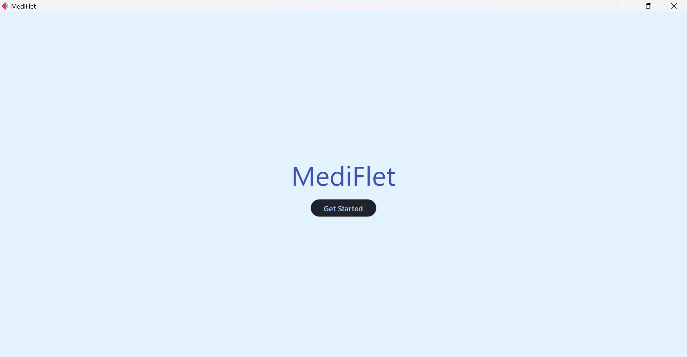

<font size = 7> MediFlet </font>

---
<br>



## Project Idea
Mediflet is an awesome meditation app made with Flet. It is easy to use, customizable, and effective. Mediflet allows users to customize their meditation experience by choosing the length of their session, the type of music they want to listen to, and more.

Mediflet is the perfect app for anyone who wants to improve their mental and physical well-being through meditation. It is a great way to start your day, relax after a long day, or simply take a break and focus on your breath.

## Team member
J Prapanch
Deepika S R

## Product Walkthrough

## How it works?

- The user learns about the importance of meditation.
- The user enters their name and how much time they want to meditate for.
- The user chooses what type of music they want to listen to.
- The timer starts and the music begins to play. The user can follow the guided meditation or meditate in silence.
- The user is congratulated and asked if they want to meditate again or exit.

## Libraries used

- Flet (Version : 0.10.3)

## How to configure & Run

<font size=3> Codebase </font>
- Open this repository through Github desktop
- Open it in VisualStudio code
- Open terminal
- Run the command below
<br>
``` pip install flet ```

- Now your system is ready to run ** MediFlet **
- Run the command below
<br>
``` flet run main.py ```
